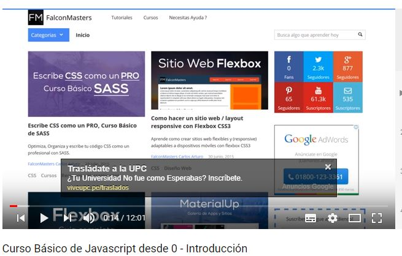

# Reto 1 UX 

## Objetivo
Elige una web de tu preferencia y explica qué partes conforman el UX y qué partes el UI.

Página Elegida :

--- 
### PARTES QUE CONFORMAN UX
* Videos recomendados según las preferencias de búsqueda del usuario.

* Buscar cualquier video en cualquier momento desde el buscador principal que siempre se encuentra en la parte superior de la página.

* Agregar comentarios y valoraciones de **Me gusta** o **No me gusta** a los videos visitados.

* Mostrar la opción tendencias para visualizar los videos con mayor visitas.

* El usuario puede crear playlist con sus videos favoritos y guardarlos en su cuenta.
* Poder otorgar la opción de **Ver más tarde** para que se establezca como prioridad en la próxima visita.

* Suscribirse a canales de su preferencia solo con un botón

* Recibir notificaciones de videos nuevos de los canales suscritos.

* Tener 6 categorias especificas para diferentes tipos de usuarios:
    
    * Academia de Creadores
    * Youtube Kids
    * Youtube Gaming 
    * Yotube Música
    * Youtube Artistas

* Contar con la opción de  historial de videos vistos.

* Brindarle al usuario la opción de personalizar su canal.

* Para los usuarios que tienen canal, tienen la opción **Analitics**  que le brinda data de como va la tendencia de su video.

* La opción de **Subir Videos** siempre se mantiene en la parte superior a lado del buscador para su mayor accesibilidad.

* Opción de **Omitir Anuncio**

* Submenú de navegación en los canales.

* Opción de subtitulos de diferentes idiomas.

* Opción filtrar 

 ***
### PARTES QUE CONFORMAN UI

* Diseño de los botones
* Los colores de la marca (plomo ,negro y rojo)
* Diseño de los iconos y efectos 

* Boton de reproducción automática en la lista de videos sugeridos.

* La posición , forma, tamaño de las miniaturas de los videos.
* Forma y tamaño de la imagen de los usuarios tanto en la parte de cuenta personal como en los comentarios.

* Estilos de fuente para los nombres de los usuarios que realizan comentarios.

* Posición y tamaño del logo.

* Estilo, tamaño , fuente y color de anuncios que aparecen en la parte inferior dentro del video.

